# Air Quality Monitor App
> Live Green, Live Clean

---

## Project Overview

**Air Quality Monitor** is a mobile application that provides real-time, global air quality data. It tracks critical atmospheric parameters like PM2.5, PM10, temperature, and humidity from thousands of stations worldwide using the OpenAQ API. Designed with a clean, responsive UI and an offline-first architecture, the app makes it easy for anyone to stay informed about their local environment.

---

## Features

- Air Quality Monitoring
- Real-time API Data
- Search Locations & Countries
- Detailed Sensor Readings (AQI, PM2.5, PM10, etc.)
- Favorite Locations
- Offline SQLite Cache
- Pull to Refresh & Pagination
- Dark & Light Mode
- Responsive UI
- Riverpod State Management
- Local User Authentication
- Local Push Notifications

---

## Screenshots

| Splash Screen | Login Screen | Register Screen |
|:---:|:---:|:---:|
| 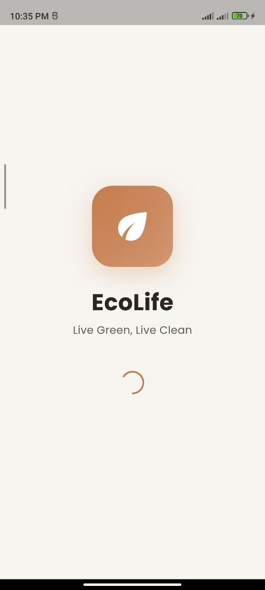 | 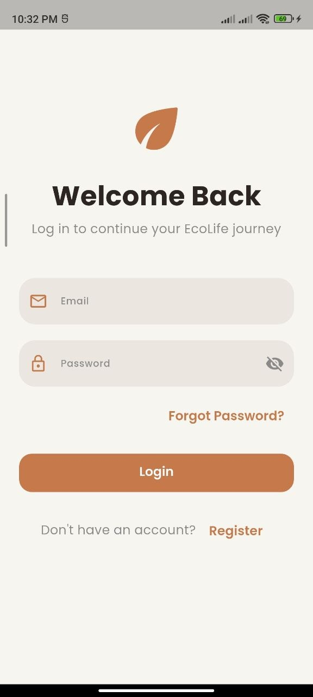 | 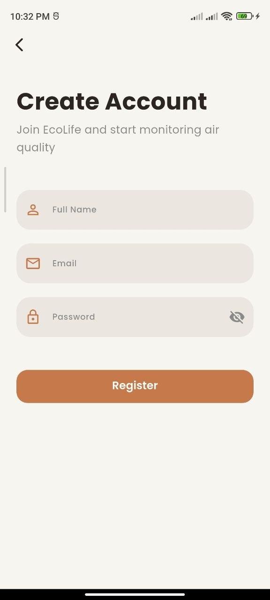 |
| **Home Screen** | **Search Screen** | **Categories** |
| 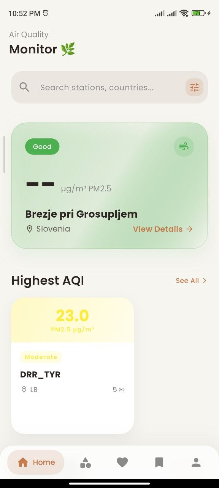 | 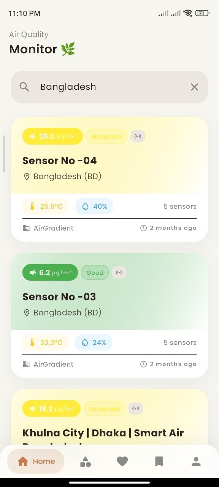 | 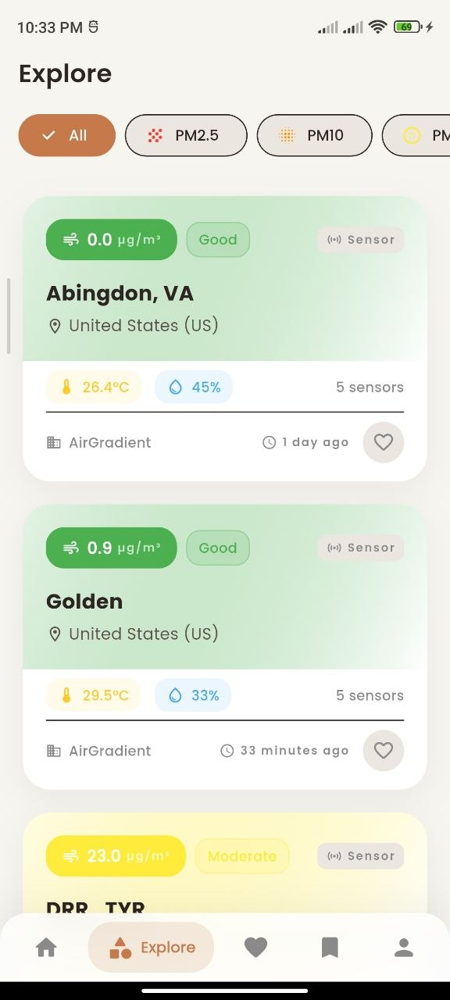 |
| **Favorites** | **Details (Charts)** | **Details (Info)** |
| 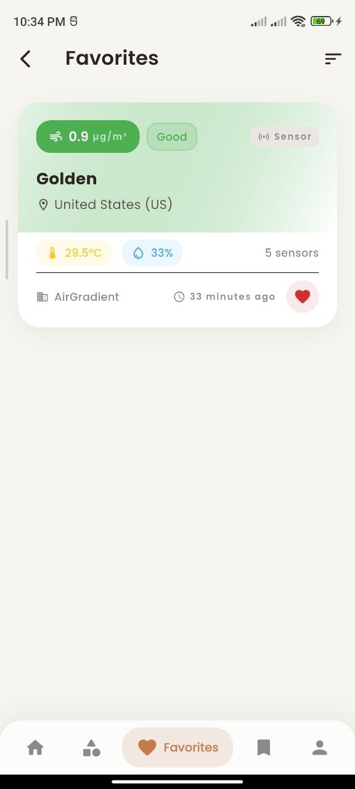 | 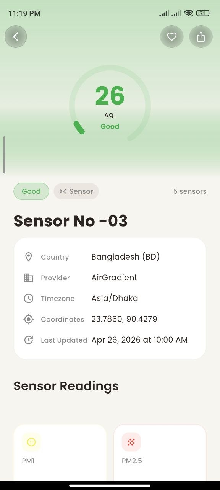 | 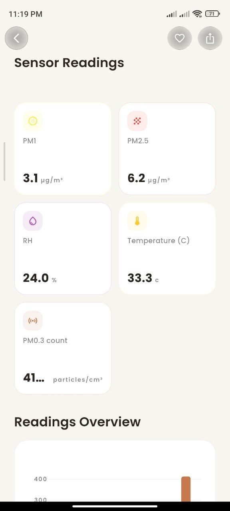 |
| **Profile** | **Dark Mode** | **Offline Mode** |
| 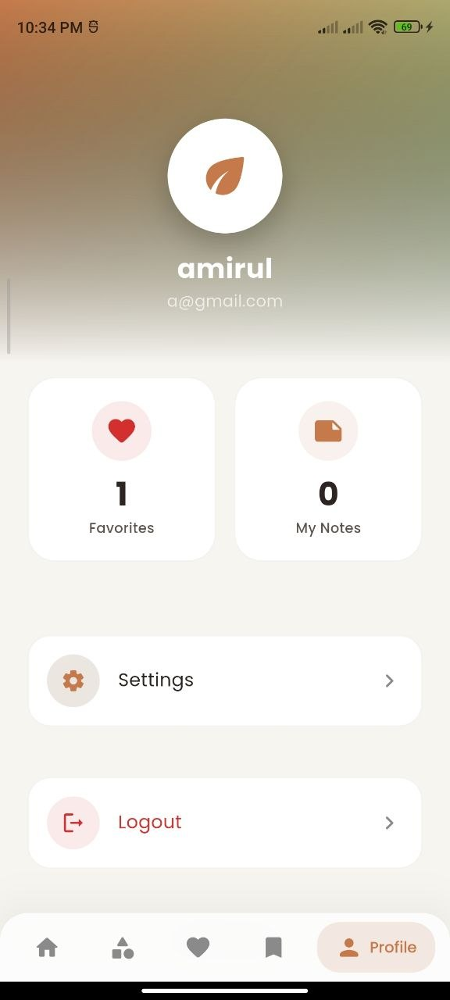 | 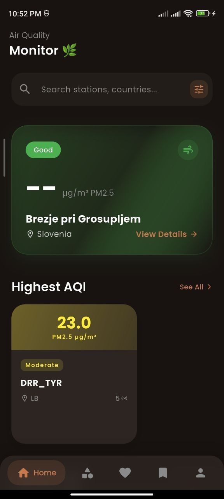 | 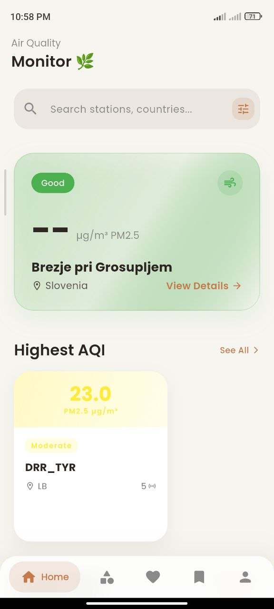 |

---

## API Used

The core data of this application is powered by the **OpenAQ API (Version 3)**.

- **API Name:** OpenAQ API v3
- **Base URL:** `https://api.openaq.org/v3`
- **Authentication:** Requires an API Key passed via the `X-API-Key` header.
- **Data Returned:** JSON formatted data containing global air quality monitoring locations, sensor parameters, historical measurements, and geographic coordinates.

**How the app consumes the API:**
The application utilizes the `dio` package to handle network requests. Requests are routed through a dedicated `RemoteDataSource` class, which handles HTTP fetching, headers, retry logic, and JSON parsing. The data is parsed into Dart models and managed by a central repository.

---

## Architecture

This project strictly adheres to a **Clean Architecture** approach combined with the **Repository Pattern**. 

- **Presentation Layer:** Contains UI components and state management logic.
- **Business Logic Layer:** Managed by **Riverpod**. Providers act as intermediaries, fetching data, handling states, and exposing reactive streams.
- **Data Layer:** 
  - **Repository Pattern:** `StationRepository` acts as the single source of truth, dictating whether data comes from the remote API or the local database (Offline-First).
  - **Remote Data Source:** Uses **Dio** to fetch live station data.
  - **Local Data Source:** Uses **SQLite** (`sqflite`) to persist stations, readings, search history, and favorites locally.

---

## Packages Used

| Package | Purpose |
|---------|---------|
| `flutter_riverpod` | State management and dependency injection |
| `dio` | Powerful HTTP client for network requests |
| `sqflite` | SQLite plugin for robust local database caching |
| `shared_preferences` | Key-value store for app settings |
| `go_router` | Declarative routing and deep linking |
| `cached_network_image` | Loading and caching network images |
| `geolocator` | Accessing device GPS for local air quality data |
| `flutter_local_notifications` | Push notifications |
| `fl_chart` | Rendering dynamic data visualization charts |
| `flutter_animate` | Creating beautiful micro-animations |
| `google_fonts` | Implementing custom modern typography |
| `crypto` | Cryptographic hashing for local user passwords |
| `intl` | Date and time formatting |

---

## Installation

```bash
# Clone the repository
git clone <your-repository-url>

# Navigate into the project directory
cd environemntapp

# Install all required dependencies
flutter pub get

# Configure your OpenAQ API Key (if required in lib/core/constants/app_constants.dart)
# const String openAqApiKey = 'YOUR_API_KEY_HERE';

# Run the application on an active emulator or connected device
flutter run
```

---

## Requirements

- **Flutter SDK Version:** ^3.12.0
- **Dart Version:** ^3.0.0
- **Android SDK:** API 21 (Lollipop) or higher
- **Supported Platforms:** Android, iOS, Linux (Desktop)

---

## How to Run Project

1. Connect your physical device or launch a virtual emulator.
2. Open a terminal in the root folder of the project.
3. Fetch dependencies: `flutter pub get`
4. Run the debug build: `flutter run`

**To build a release APK for Android:**
```bash
flutter build apk --release
```
The compiled APK will be located in `build/app/outputs/flutter-apk/app-release.apk`.

---

## Author

- **Developer Name:** Amiry
- **University:** International Islamic University Chittagong (IIUC)
- **Course:** Industrial Training
- **Year:** 2026

---

## License

This project is developed for educational purposes and is part of a university industrial training assignment.
