# Cinema

> **Your Cinema, Anywhere** — A premium movie streaming Flutter application

## Overview

Cinema is a premium, cross-platform movie discovery and streaming application built with Flutter. Designed with a sleek, cinematic dark theme inspired by industry-leading platforms, it delivers a seamless user experience across mobile and desktop devices. 

Powered by the robust **TMDb (The Movie Database) API**, Cinema provides users with real-time access to trending, popular, and top-rated movies, along with comprehensive details, cast information, and categorized discovery. The app goes beyond standard metadata by seamlessly integrating an in-app video player to stream high-quality movie trailers directly from YouTube.

Furthermore, Cinema includes built-in secure user authentication and robust local data management powered by SQLite, enabling persistent sessions and allowing users to manage personal watchlists seamlessly.

## Screenshots

| Splash | Login | Register |
|---|---|---|
| 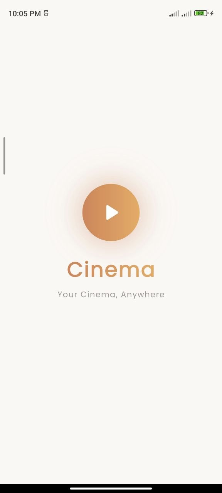 | 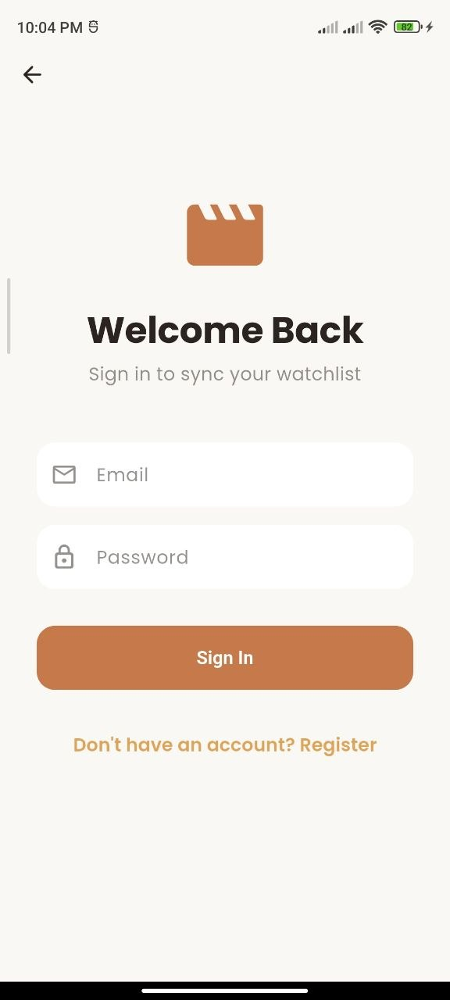 | 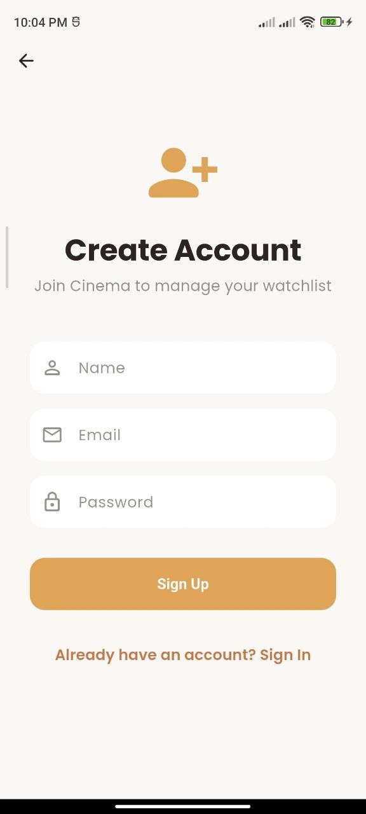 |

| Home | Details | Video Player |
|---|---|---|
| 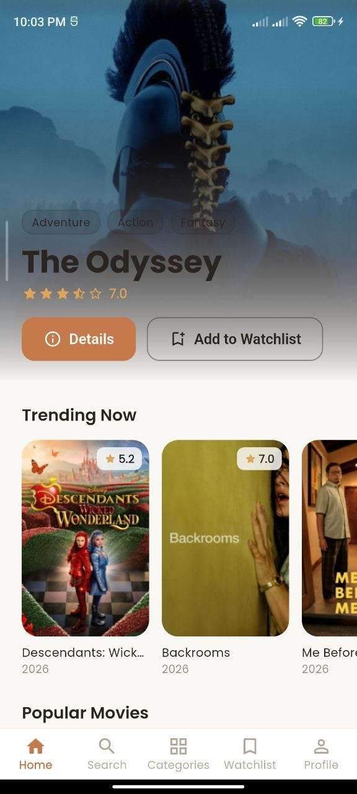 | 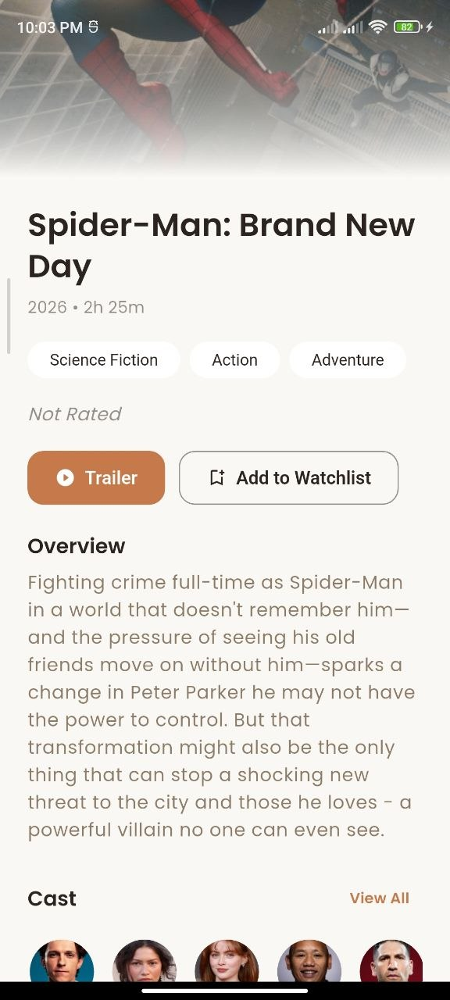 |  |

| Search | Category | Watchlist |
|---|---|---|
| 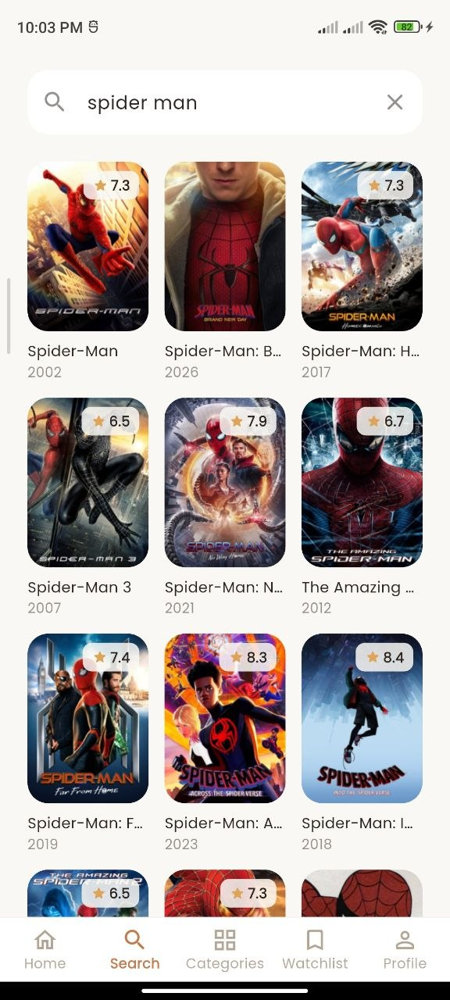 | 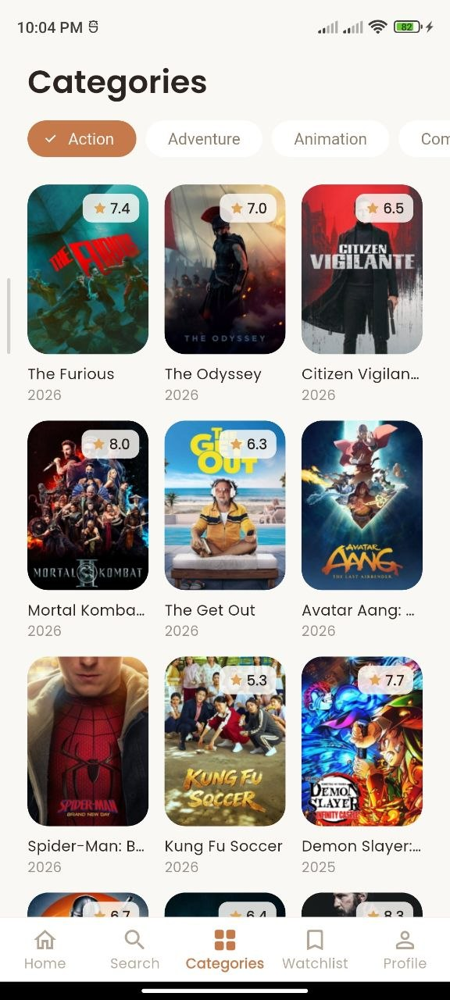 | 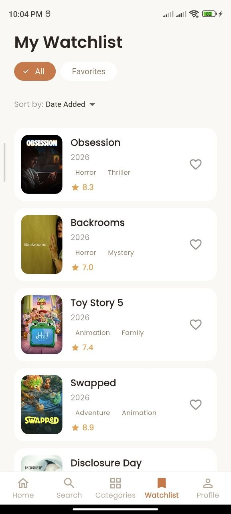 |

| Profile | Favorites |
|---|---|
| 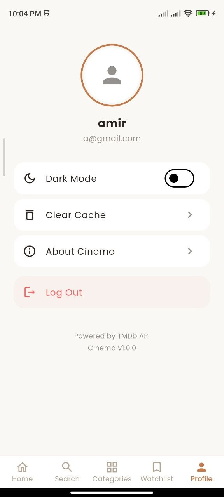 | 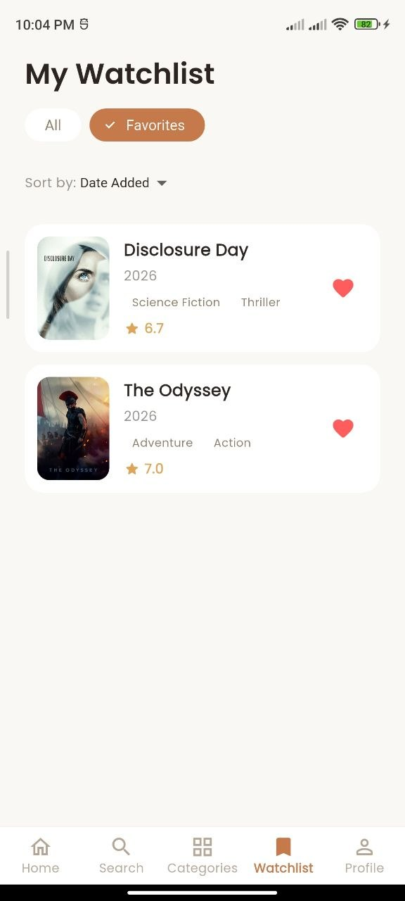 |

| Dark Mode | Offline Mode |
|---|---|
| 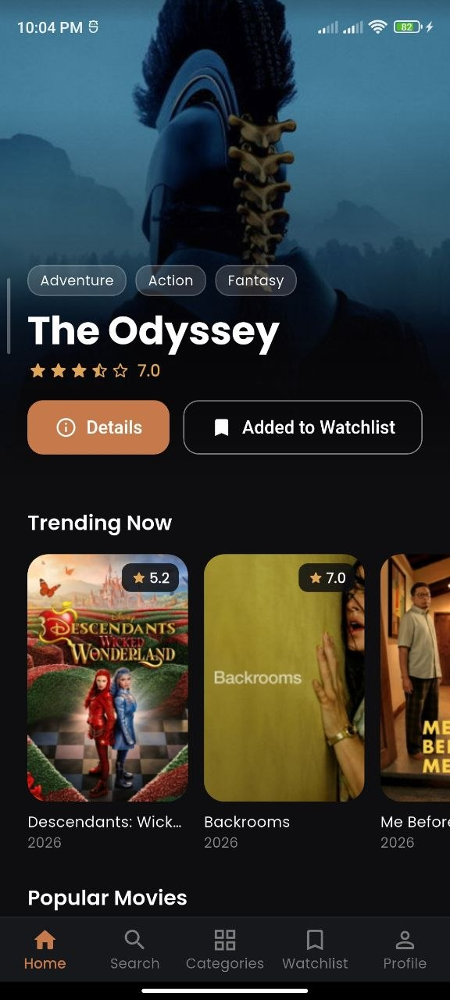 | 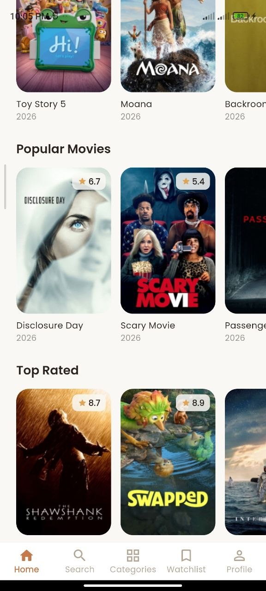 |

## API Used

**TMDb API v3** — https://api.themoviedb.org/3
- Auth: Free API key  
- Returns: JSON  
- Endpoints: trending, popular, top_rated, now_playing, upcoming, search, movie details, genres, discover

**YouTube Integration**
- Using `youtube_explode_dart` to extract and play trailers directly without requiring the official YouTube API key.

## Features

### Core Features
- User Authentication (Registration & Login via SQLite)
- Home Screen with hero banner and horizontal scrolling sections
- Movie Detail Screen with cast, genres, similar movies, and blurred backdrop
- In-App Video Player for YouTube trailers (via `media_kit`)
- Watchlist Management (Add, Remove via SQLite)
- Debounced Search (500ms) with grid results and pagination
- Infinite Scrolling pagination on all lists
- Share movie functionality
- Error Handling (no internet, API failure, empty/loading states)
- Responsive UI (Mobile, Tablet, Desktop)

### Bonus Features
- Premium Dark Cinematic Theme
- Local Cache with SQLite for offline access
- Dependency Injection (GetIt)
- Scoped State Management (Provider)
- Cross-platform support (Android, iOS, Linux)

## Packages Used

| Package | Purpose |
|---------|---------|
| `dio` | HTTP client |
| `provider` | State management |
| `sqflite` & `sqflite_common_ffi` | Local database & auth |
| `cached_network_image` | Image caching |
| `media_kit` & `media_kit_video` | In-app video player |
| `youtube_explode_dart` | YouTube metadata extraction |
| `share_plus` | Native sharing |
| `url_launcher` | Launch external URLs |
| `flutter_screenutil` | Responsive sizing |
| `get_it` | Dependency injection |
| `connectivity_plus` | Network status |
| `google_fonts` | Poppins typography |
| `shimmer` | Loading effects |

## How to run project

1. **Clone the repository** (if you haven't already).
2. **Get a free TMDb API key** at https://www.themoviedb.org/settings/api
3. **Add the key** in `lib/core/constants/api_constants.dart`
4. **Install dependencies**:
   ```bash
   flutter pub get
   ```
5. **Run the app**:
   ```bash
   flutter run
   ```
6. **Build APK** (Release):
   ```bash
   flutter build apk --release
   ```

## Design

- Theme: Premium dark cinematic
- Colors: Background #0E0E10, Accent #C67A4B
- Font: Poppins (Google Fonts)
- Inspired by Netflix, Apple TV+, HBO Max
